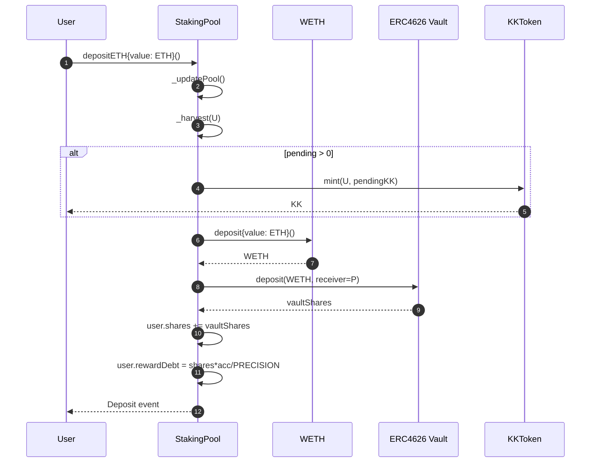
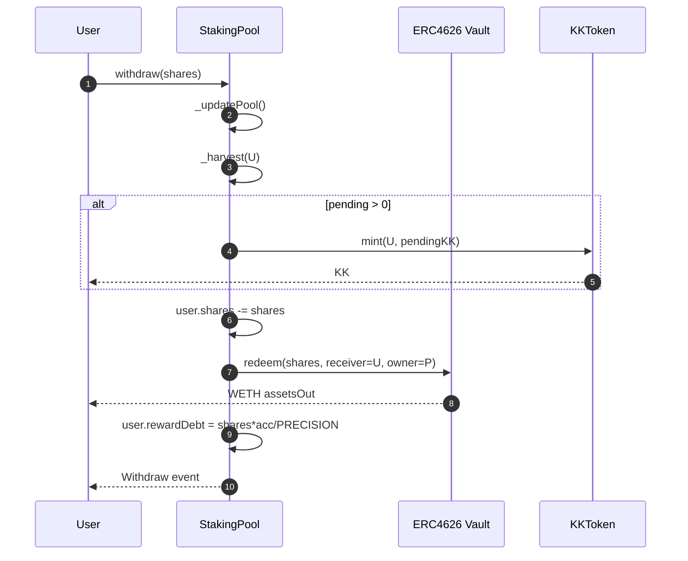
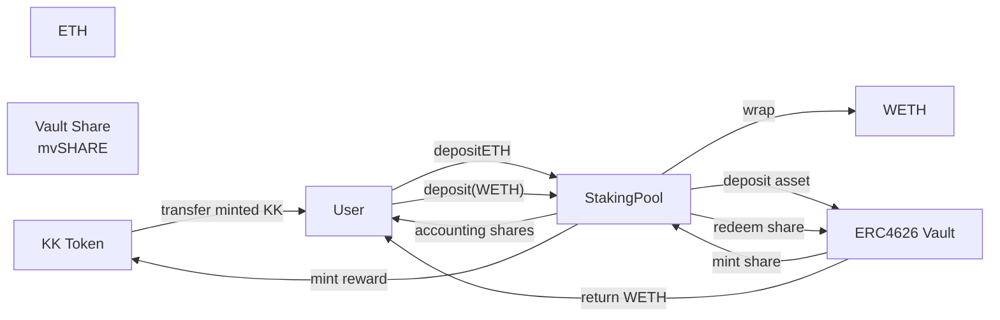

# Staking 合约操作文档

## 1. 目录与合约职责

- `KKToken.sol`：奖励代币，只有绑定的 `StakingPool` 可以 `mint`。
- `StakingPool.sol`：核心质押池，接收 `WETH`，存入 `ERC4626 Vault`，按区块给用户发放 `KK`。
- `interfaces/IWETH.sol`：最小 `WETH` 接口（`deposit/withdraw`）。
- `mocks/MockWETH.sol`：本地测试用 `WETH`，`ETH <-> WETH` 1:1 包装/解包。
- `mocks/MockERC4626Vault.sol`：本地测试用金库，底层资产为 `WETH`，share 为 `mvSHARE`。

---

## 2. 核心机制说明

`StakingPool` 采用 MasterChef 风格奖励模型：

- 全局累计值：`accRewardPerShare`（每 1 share 累计 KK，按 `1e12` 放大）。
- 更新时间点：`lastRewardBlock`。
- 用户状态：
  - `shares`：用户持有的 vault share（质押权重）。
  - `rewardDebt`：用户已结算奖励债务。
- 待领取奖励公式：
  - `pending = shares * accRewardPerShare / PRECISION - rewardDebt`

执行 `deposit/withdraw/claim` 时，都会先：

1. `_updatePool()`：把区块增量奖励累计进全局；
2. `_harvest(user)`：把用户截至当前的 pending KK 铸造到用户地址；
3. 再处理份额变化（如有）并刷新 `rewardDebt`。

---

## 3. 部署与初始化流程

建议顺序：

1. 部署 `WETH`（测试环境可用 `MockWETH`）。
2. 部署 `ERC4626 Vault`（资产必须是 `WETH`，测试环境可用 `MockERC4626Vault`）。
3. 部署 `KKToken(initialOwner)`。
4. 部署 `StakingPool(weth, vault, kk, rewardPerBlock)`。
5. 调用 `KKToken.setStakingPool(pool)`（只能设置一次）。

关键校验：

- `StakingPool` 构造函数会检查 `vault.asset() == weth`。
- `rewardPerBlock` 必须大于 0。
- `KKToken` 仅允许已绑定池子地址调用 `mint`。

---

## 4. 常见操作手册

### 4.1 质押（用户持有 WETH）

1. 用户先对 `StakingPool` 执行 `WETH.approve(pool, amount)`。
2. 调用 `StakingPool.deposit(amount)`。
3. 池子把 WETH 存入 Vault，获得 share 并记到用户 `shares`。

### 4.2 质押（用户持有 ETH）

1. 直接调用 `StakingPool.depositETH{value: amount}()`。
2. 池子内部先 `weth.deposit()` 把 ETH 包装成 WETH。
3. 再把 WETH 存入 Vault，按返回 share 入账。

### 4.3 领取奖励

1. 调用 `StakingPool.claim()`。
2. 池子更新奖励并执行 `_harvest`。
3. 由 `KKToken.mint(user, pending)` 向用户发放 KK。

### 4.4 赎回

1. 调用 `StakingPool.withdraw(shares)`。
2. 池子先结算并发放 KK。
3. 从 Vault 按 share 赎回 WETH，直接转给用户。

---

## 5. 调用时序图

### 5.1 `depositETH()` 调用时序

### 5.2 `withdraw(shares)` 调用时序

---

## 6. Token 转换关系图

关系说明：

- 资产主线：`ETH -> WETH -> Vault Share`（入池）与 `Vault Share -> WETH`（出池）。
- 激励主线：用户依据持有 `Vault Share` 权重，按区块获得 `KK`。
- `StakingPool` 只持有 Vault Share；用户在池内通过记账映射持有对应份额权益。

---

## 7. 运行与运维注意事项

- 无人质押期间（`totalShares == 0`）的区块奖励不会分配给任何人；仅推进 `lastRewardBlock`。
- `KKToken.setStakingPool` 只能执行一次，部署脚本要严格保证顺序。
- `deposit` 使用 `safeIncreaseAllowance`，长期运行可关注授权增长策略（若未来接入不同 vault，可考虑重置授权策略）。
- 奖励发放为“按块线性、按 share 比例”；Vault 收益（share 对 asset 的兑换率变化）与 KK 挖矿是两条独立收益线。
- 本实现 `withdraw` 赎回的是 `WETH`；若产品层面希望用户拿回 `ETH`，需在外层再加一次 `WETH.withdraw` 封装逻辑。

---

## 8. 逐块演算示例（可对照测试）

### 8.1 参数与事件设定

- `rewardPerBlock = 10 KK`
- 为了便于演示，先忽略 `PRECISION=1e12` 放大，`acc` 直接表示“每 1 share 累计可得 KK”。
- 初始：`acc=0`，`lastRewardBlock=100`，`totalShares=0`
- 事件序列：
  1. 块 `100`：A `deposit` 获得 `100 shares`
  2. 块 `103`：B `deposit` 获得 `100 shares`
  3. 块 `106`：A `claim`
  4. 块 `108`：A `withdraw(50 shares)`
  5. 块 `110`：B `claim`

### 8.2 逐步状态变化

| 步骤 | 块高 | 动作 | `_updatePool` 增量 | `acc` | `A(shares,debt)` | `B(shares,debt)` | `totalShares` | 本步发放 KK |
|---|---:|---|---|---:|---|---|---:|---:|
| 0 | 100 | 初始状态 | - | 0.00 | (0, 0.00) | (0, 0.00) | 0 | 0 |
| 1 | 100 | A 存入 100 | `total=0`，不分配，仅更新 `last` | 0.00 | (100, 0.00) | (0, 0.00) | 100 | 0 |
| 2 | 103 | B 存入 100 | `[100,103)`：`30/100=+0.30` | 0.30 | (100, 0.00) | (100, 30.00) | 200 | 0 |
| 3 | 106 | A `claim` | `[103,106)`：`30/200=+0.15` | 0.45 | (100, 45.00) | (100, 30.00) | 200 | A: 45 |
| 4 | 108 | A 提现 50 | `[106,108)`：`20/200=+0.10` | 0.55 | (50, 27.50) | (100, 30.00) | 150 | A: 10 |
| 5 | 110 | B `claim` | `[108,110)`：`20/150=+0.133333` | 0.683333 | (50, 27.50) | (100, 68.3333) | 150 | B: 38.3333 |

> 说明：第 4 步里 A 会先按旧仓位 `100 shares` 收到增量奖励，再把仓位降到 `50 shares`，最后用新仓位重置 `debt`。

### 8.3 每一步 pending 的关键计算

- 第 3 步（A 在块 106 claim）  
  `pendingA = 100 * 0.45 - 0 = 45`

- 第 4 步（A 在块 108 withdraw 前 harvest）  
  `pendingA = 100 * 0.55 - 45 = 10`

- 第 5 步（B 在块 110 claim）  
  `pendingB = 100 * 0.683333 - 30 = 38.3333`

### 8.4 守恒校验（总奖励闭环）

- 区间 `[100,110)` 共 `10` 块，总产出应为 `10 * 10 = 100 KK`
- 已发放：
  - A：`45 + 10 = 55`
  - B：`38.3333`
  - 合计：`93.3333`
- 未发放但已累计（块 110 时）：
  - A：`50 * 0.683333 - 27.5 = 6.6667`
  - B：`0`
  - 合计：`6.6667`
- 闭环：`93.3333 + 6.6667 = 100`

这个演算可直接用来编写单测断言：对比每个动作后 `accRewardPerShare`、`rewardDebt`、`pendingReward` 和实际 `KK` 余额变化是否一致。
